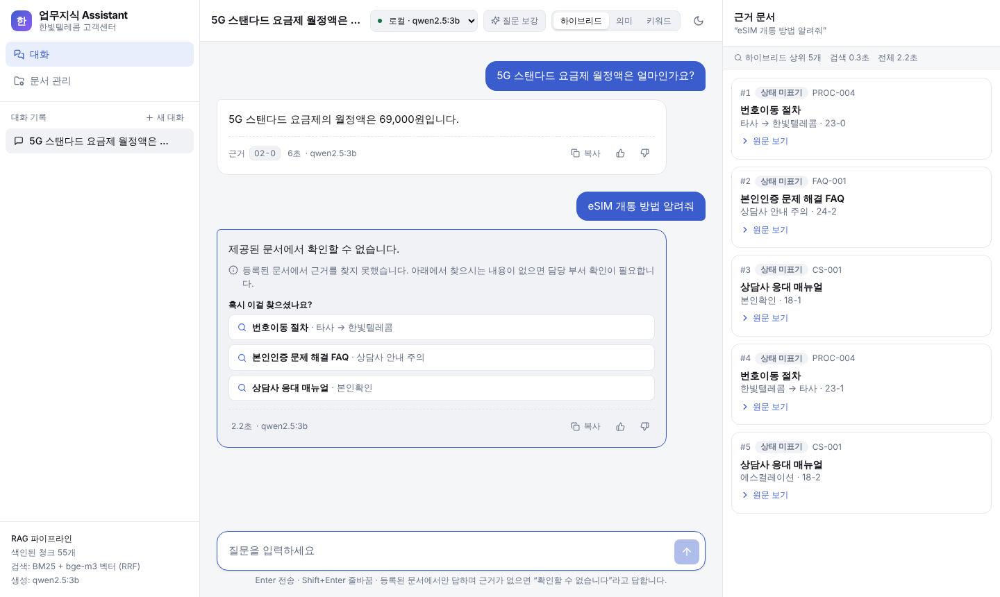
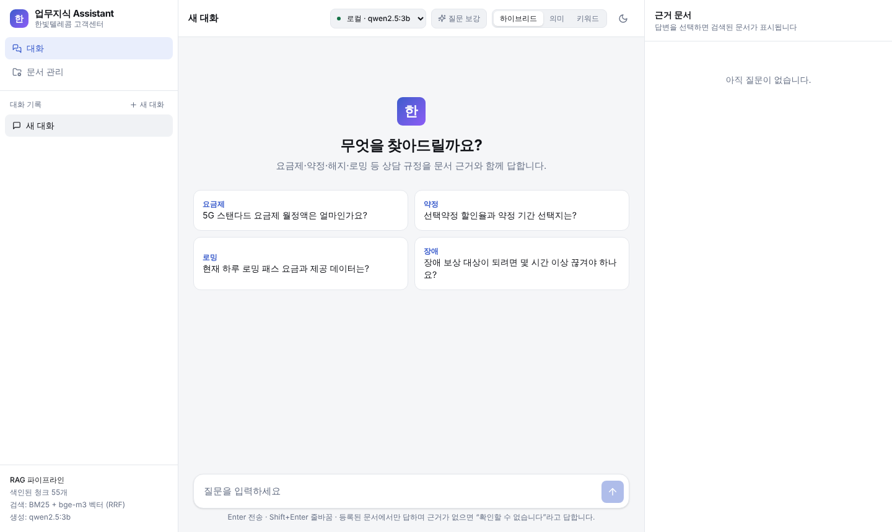
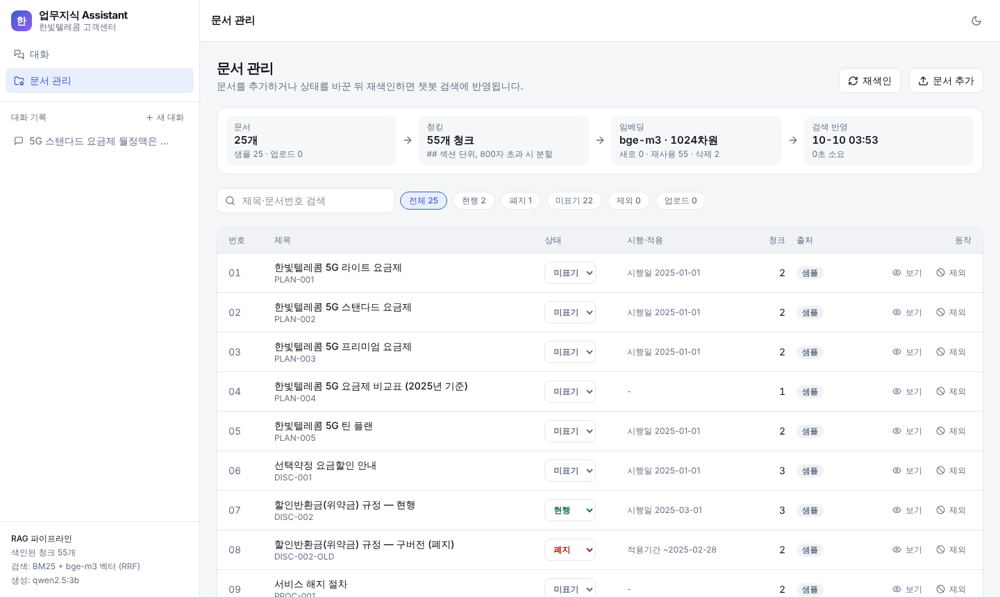
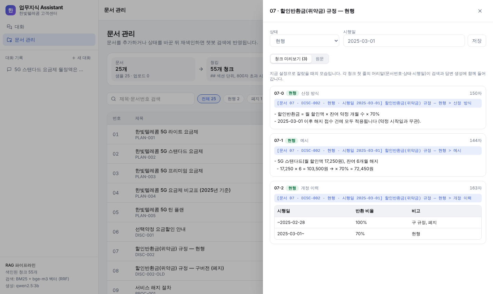

# 업무지식 검색 챗봇 (RAG 연습 개인 프로젝트)

가상 통신사 **"한빛텔레콤"** 고객센터 문서 25개로 만든 **문서 근거 기반 질의응답 챗봇**입니다.
상담사가 요금제·약정·해지·로밍 같은 규정을 물으면, 등록된 문서에서 근거를 찾아 답하고 출처를 함께 보여줍니다.

> **연습용 프로토타입입니다.** 문서는 모두 가상의 더미 데이터이며, RAG(검색 증강 생성)의 구조를 직접 만들어 보며 이해하는 것이 목적입니다.
> 연습에서 확인한 사실과 실제 프로젝트에서 다시 정할 것은 **[RAG 연습 회고 노트](docs/rag_practice_notes.md)** 에 정리했습니다.



---

## 목차

1. [주요 기능](#1-주요-기능)
2. [화면 둘러보기](#2-화면-둘러보기)
3. [동작 원리](#3-동작-원리)
4. [폴더 구조](#4-폴더-구조)
5. [실행 방법 (macOS 기준)](#5-실행-방법-macos-기준)
6. [평가와 실험 결과](#6-평가와-실험-결과)
7. [알려진 한계](#7-알려진-한계)
8. [문제 해결](#8-문제-해결)

---

## 1. 주요 기능

| 기능 | 설명 |
|---|---|
| **근거 기반 답변** | 등록된 문서에서 찾은 내용으로만 답합니다. 근거가 없으면 지어내지 않고 "확인할 수 없습니다"라고 답합니다. |
| **현행 / 폐지 구분** | 문서마다 상태(현행·폐지)와 시행일을 붙여, 개정 전 규정을 현재 규정으로 잘못 안내하지 않도록 합니다. |
| **하이브리드 검색** | 키워드 검색(BM25)과 의미 검색(임베딩 벡터)을 함께 사용합니다. |
| **질문 보강** | "폰 잃어버렸어" 같은 일상 표현을 "분실 도난 일시정지" 같은 업무 용어로 바꿔 함께 검색합니다. |
| **못 찾았을 때 추천** | 답을 찾지 못하면 관련 있어 보이는 문서를 "혹시 이걸 찾으셨나요?"로 제안합니다. |
| **생성 모델 선택** | 로컬 모델(Ollama · qwen2.5:3b)과 외부 API(Groq · gpt-oss-120b) 중에서 고를 수 있습니다. |
| **문서 관리** | 문서 업로드, 상태 지정, 청크 미리보기, 재색인(바뀐 부분만 다시 처리)을 화면에서 할 수 있습니다. |
| **평가 도구** | 검색 정확도와 답변 정확도를 따로 채점하는 스크립트와 질문 세트가 들어 있습니다. |

---

## 2. 화면 둘러보기

| 첫 화면 | 문서 관리 |
|---|---|
|  |  |
| 예시 질문을 누르거나 직접 입력합니다. 상단에서 생성 모델·질문 보강·검색 방식을 고를 수 있습니다. | 문서 목록, 상태 변경, 업로드, 재색인을 합니다. 상단에 색인 단계별 현황이 보입니다. |

**청크 미리보기** — 문서가 어떻게 잘려서 검색에 쓰이는지 확인할 수 있습니다. 각 청크 첫 줄의 파란 머리말(문서번호·상태·시행일)이 검색과 답변 생성에 함께 들어갑니다.



---

## 3. 동작 원리

RAG는 **① 문서를 미리 검색 가능한 형태로 준비해 두고(색인)**, **② 질문이 들어오면 관련 부분을 찾아 그 내용을 근거로 답을 만드는(검색 + 생성)** 두 단계로 나뉩니다.

```
① 색인 (문서가 바뀔 때만)
   문서(.md) ──▶ 청킹 ──────────────▶ 임베딩 ──────────────▶ 저장
               섹션 단위로 자르고        각 청크를 숫자 벡터로      chunks.jsonl
               머리말(상태·시행일) 붙임   변환 (bge-m3)              embeddings.json

② 질문할 때마다
   질문 ──▶ 질문 보강 ──▶ 검색 ──────────────────▶ 답변 생성 ──────────────▶ 화면
           업무 용어로     키워드(BM25) + 의미(벡터)    찾은 청크 + 규칙 + 질문을    답 + 근거 문서
           바꿔 함께 검색  결과를 합쳐 상위 5개 선택    LLM에 전달 (근거 없으면 거부)  (한 글자씩 표시)
```

| 단계 | 하는 일 | 담당 파일 |
|---|---|---|
| 청킹 | 문서를 `##` 섹션 단위로 자르고, 모든 조각에 `[문서번호 · 상태 · 시행일]` 머리말을 붙임 | `chunk.py` |
| 임베딩·색인 | 각 조각을 1024차원 벡터로 변환해 저장. 다시 색인할 때는 바뀐 조각만 처리 | `embed.py`, `indexer.py` |
| 검색 | 키워드 검색과 의미 검색 결과를 순위 기준으로 합침(RRF) | `retrieve.py` |
| 질문 보강·추천 | 일상 표현 → 업무 용어 변환, 못 찾았을 때 추천 질문 생성 | `query.py` |
| 답변 생성 | "자료 → 규칙 → 질문" 순서의 프롬프트를 만들어 모델 호출 | `answer.py`, `llm.py` |
| 서버·화면 | 웹 API(답변을 실시간 스트리밍) + React 화면 | `server.py`, `frontend/` |

---

## 4. 폴더 구조

```
RAG-/
├── README.md                  이 문서
├── requirements.txt           Python 패키지 목록 (fastapi, uvicorn, certifi)
├── .env.example               Groq API 키 설정 예시 (.env로 복사해서 사용)
│
├── rag_dummy/                 ▶ 연습용 데이터
│   ├── docs/                    한빛텔레콤 고객센터 문서 25개 (가상)
│   └── eval_questions.csv       평가 질문 30개 (함정·답없음 문항 포함)
│
├── chunk.py                   ▶ ① 색인: 문서 → 청크
├── embed.py                     청크 → 벡터 (처음 한 번 전체)
├── indexer.py                   문서 관리·재색인 (바뀐 청크만 다시 임베딩)
│
├── retrieve.py                ▶ ② 검색: 키워드·의미·하이브리드
├── query.py                     질문 보강, 못 찾았을 때 추천
├── answer.py                    프롬프트 조립, 로컬 모델 호출
├── llm.py                       생성 모델 선택 (로컬 Ollama ↔ Groq)
│
├── server.py                  ▶ 웹 서버 (FastAPI)
├── frontend/                    React 화면 (Vite + TypeScript + Tailwind)
├── static/index.html            빌드 없이 쓰는 간단한 화면 (예전 버전)
├── chat.py                      터미널에서 쓰는 챗봇
│
├── eval_retrieval.py          ▶ 평가: 검색 정확도
├── eval_answer.py               평가: 답변 정확도
├── experiments/                 실험 기록과 추가 질문 세트
│
└── docs/                      ▶ 문서
    ├── rag_practice_notes.md    연습 회고 노트 (배운 점, 실무 체크리스트)
    └── images/                  README 화면 캡처
```

실행 중에 생기는 파일(`chunks.jsonl`, `embeddings.json`, `uploads/`, `.env` 등)은 git에 올라가지 않습니다.

---

## 5. 실행 방법 (macOS 기준)

> 명령은 **한 줄씩** 복사해서 실행하세요. 맥의 기본 터미널(zsh)은 명령 뒤에 붙은 `# 설명`을 주석으로 처리하지 않아서, 설명은 명령 아래에 따로 적었습니다.

### 준비물

| 항목 | 용도 | 설치 |
|---|---|---|
| Python 3.10 이상 | 서버·검색·평가 | python.org |
| [Ollama](https://ollama.com) | 로컬 모델 실행 (임베딩·답변) | 앱 설치 후 실행 |
| Node.js (LTS) | React 화면 **빌드** (실행에는 불필요) | nodejs.org |

### 처음 한 번

```bash
git clone https://github.com/spencerpark00/RAG-.git rag
cd rag
python3 -m venv .venv
source .venv/bin/activate
pip install -r requirements.txt
ollama pull qwen2.5:3b
ollama pull bge-m3
python indexer.py
cd frontend
npm install
npm run build
cd ..
```

- `python3 -m venv .venv`, `source .venv/bin/activate`: 이 프로젝트 전용 Python 환경을 만들고 켭니다.
- `ollama pull …`: 답변 모델(약 1.9GB)과 임베딩 모델(약 1.2GB)을 받습니다.
- `python indexer.py`: 문서를 청크로 자르고 임베딩합니다. `문서 25개 → 청크 55개`가 나오면 정상입니다.
- `npm install`, `npm run build`: React 화면을 빌드합니다. 화면 코드를 고쳤을 때만 다시 하면 됩니다.

### 실행

```bash
source .venv/bin/activate
python server.py
```

브라우저에서 **http://localhost:8000** 을 엽니다. 서버를 끌 때는 터미널에서 `Ctrl + C`를 누릅니다.

### (선택) 외부 모델 Groq 사용하기

로컬 3b 모델은 빠르지 않고 복잡한 질문에 약합니다. 무료 API인 Groq를 연결하면 화면 상단에서 고를 수 있습니다.

1. https://console.groq.com 에 가입한 뒤 **API Keys**에서 키를 만듭니다.
2. 아래 명령으로 키를 저장합니다. `read -s` 실행 후 키를 붙여 넣고 Enter를 누릅니다(화면에 보이지 않는 게 정상).
3. 서버를 껐다 켜면 상단 모델 선택에 **Groq · gpt-oss-120b**가 나타납니다.

```bash
read -s KEY
printf 'GROQ_API_KEY=%s\nGROQ_MODEL=openai/gpt-oss-120b\n' "$KEY" > .env
unset KEY
```

> ⚠️ Groq를 쓰면 질문과 검색된 문서 원문이 외부 서버로 전송됩니다. **더미 데이터에만** 사용하세요.

### 터미널에서 쓰기

```bash
python chat.py
python chat.py --llm=groq
```

질문을 입력하고, `/근거`로 직전 답의 근거 원문을 보고, `/종료`로 끝냅니다.

---

## 6. 평가와 실험 결과

검색과 답변을 **따로** 채점합니다. 정확도 하나만 보면, 틀린 원인이 "문서를 못 찾아서"인지 "찾고도 답을 잘못 써서"인지 구분할 수 없기 때문입니다.

```bash
python eval_retrieval.py
python eval_retrieval.py --set=colloquial
python eval_answer.py
python eval_answer.py --llm=groq
```

- `eval_retrieval.py`: 정답 문서가 검색 결과 상위 k개에 들어오는지 (`--retriever=bm25|vector|hybrid`로 방식 비교)
- `--set=colloquial`: 문서 용어를 쓰지 않은 일상 표현 질문 15개로 평가 (`--rewrite`를 붙이면 질문 보강 적용)
- `eval_answer.py`: 답변에 정답 핵심이 들어 있는지, 답이 없는 질문을 제대로 거부하는지

### 주요 결과 (질문 30~45개 기준, 참고용)

| 실험 | 결과 | 기록 |
|---|---|---|
| 프롬프트 규칙 위치 변경 (로컬 3b) | 답이 있는 질문을 거부하는 경우 **14건 → 2건** | [prompt_v2.md](experiments/prompt_v2.md) |
| 검색 방식 비교 | 정답 문서가 1위로 검색된 비율 키워드 22/27 → 하이브리드 **25/27** | 위 명령으로 재현 |
| 질문 보강 (일상 표현 15개) | 정답 문서 검색 **11 → 14개** | [query_rewrite.md](experiments/query_rewrite.md) |
| 생성 모델 교체 | 날짜 계산 질문을 3b는 거부(135초), gpt-oss-120b는 정답(2.6초) | [회고 노트](docs/rag_practice_notes.md) |

> 같은 설정으로 다시 실행해도 1~2문항 정도는 결과가 달라질 수 있습니다. 작은 차이는 우연일 수 있으니 여러 번 실행해 비교하세요.

---

## 7. 알려진 한계

| 한계 | 설명 |
|---|---|
| 이전 대화를 기억하지 않음 | "그럼 12개월 남았으면요?" 같은 후속 질문은 앞 대화를 모르고 처리합니다. |
| 로컬 3b 모델의 성능 | 날짜 비교·계산 질문을 거부하는 경우가 있습니다. 큰 모델(Groq)로 바꾸면 개선됩니다. |
| 문서 형식 | `.md`, `.txt`만 지원합니다. PDF·HWP·엑셀은 처리하지 않습니다. |
| 저장 방식 | 벡터를 JSON 파일에 저장합니다. 문서가 많아지면 벡터 DB가 필요합니다. |
| 평가 규모 | 질문 30~45개로 측정한 결과라 일반화에 한계가 있습니다. |

---

## 8. 문제 해결

| 증상 | 원인 | 해결 |
|---|---|---|
| `command not found: python` | 가상환경이 꺼져 있음 | `source .venv/bin/activate` |
| `npm install` 실패 (`EINVALIDTAGNAME`) | 명령 뒤에 `# 설명`을 함께 붙여 넣음 | 명령만 따로 입력 |
| `tsc: command not found` | `npm install`이 안 됨 | `frontend` 폴더에서 `npm install` 다시 실행 |
| 화면에 "Ollama 연결 안 됨" | Ollama 앱이 꺼져 있음 | Ollama 앱 실행 (`open -a Ollama`) |
| 모델 선택에 Groq가 없음 | `.env`를 만든 뒤 서버를 다시 켜지 않음 | `Ctrl + C` 후 `python server.py` |
| Groq `CERTIFICATE_VERIFY_FAILED` | 맥 Python에 인증서 목록이 없음 | `pip install -r requirements.txt` (certifi 설치) |
| 예전 화면(사이드바 없음)이 보임 | React 화면을 빌드하지 않음 | `cd frontend` → `npm run build` |
| 의미 검색 대신 "키워드 검색으로 대체" 안내 | 질문 임베딩에 쓰는 Ollama가 꺼져 있음 | Ollama 실행 (키워드 검색으로는 계속 동작) |
